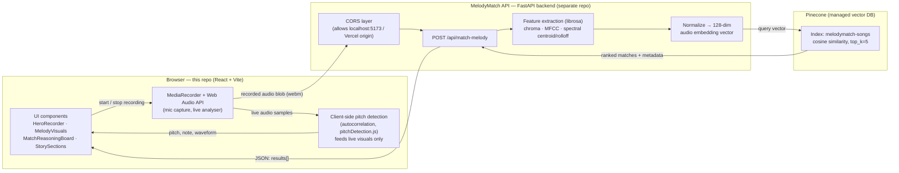
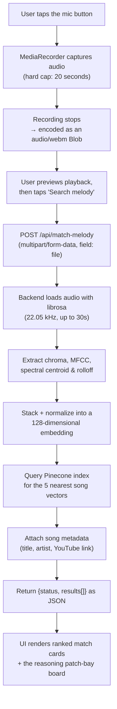
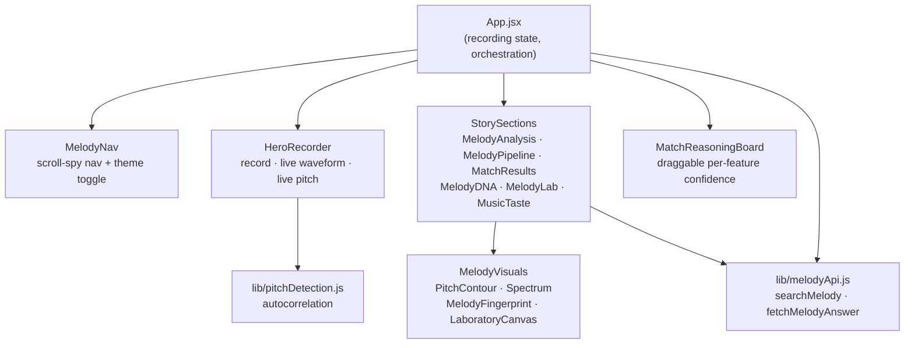

# MelodyMatch — Frontend

**Hum it, whistle it, or sing the bit you remember — MelodyMatch listens and finds the song.**

This is the web client for MelodyMatch: a single-page React app that records a short clip of you humming or singing, visualizes the sound in real time, sends it to the MelodyMatch API for melody recognition, and presents ranked song matches with a breakdown of *why* each one matched.

The backend (Python/FastAPI + audio ML) lives in a separate repo: **[MelodyMatch-V1](https://github.com/sameera-7-hash/MelodyMatch-V1)**. This document covers both, so a newcomer can understand the whole system from here.

---

## Table of contents

- [What it does](#what-it-does)
- [Tech stack](#tech-stack)
- [System architecture](#system-architecture)
- [End-to-end matching flow](#end-to-end-matching-flow)
- [Client-side pitch detection](#client-side-pitch-detection)
- [Page walkthrough](#page-walkthrough)
- [Component map](#component-map)
- [API contract](#api-contract)
- [Project structure](#project-structure)
- [Getting started](#getting-started)
- [Environment variables](#environment-variables)
- [Deployment](#deployment)
- [Status & known gaps](#status--known-gaps)

---

## What it does

Every song has a "shape" — the way pitch rises and falls over time. MelodyMatch turns a hummed or sung clip into that shape, compares it against a library of reference songs, and returns the closest matches with a confidence score, so you can find a song when you only remember the tune and not the name.

## Tech stack

| Layer | Technology | Purpose |
|---|---|---|
| UI framework | React 19 + Vite 8 | Component-based SPA, fast dev server & build |
| Styling | Tailwind CSS 4 | Utility-first styling, light/dark theme |
| UI helpers | lucide-react, class-variance-authority, clsx, tailwind-merge | Icons and conditional class composition (`cn()` in `lib/utils.js`) |
| Browser audio | MediaRecorder API, Web Audio API (`AudioContext`, `AnalyserNode`) | Microphone capture, live waveform/volume, recording |
| Linting | Oxlint | Fast Rust-based JS/TS linter |
| Hosting | Vercel | Static SPA hosting, rewrites everything to `index.html` |
| Backend framework | Python 3, FastAPI, Uvicorn | HTTP API that receives audio and returns matches |
| Audio feature extraction | librosa, NumPy | Chroma, MFCC, spectral centroid & rolloff → 128‑dim embedding |
| Similarity search | Pinecone | Vector index (`melodymatch-songs`), cosine similarity, top‑k query |

## System architecture



## End-to-end matching flow



## Client-side pitch detection

While the *real* match comes from the backend, the recorder panel shows a **live pitch readout and waveform** while you're humming — implemented entirely in the browser for instant feedback, with no server round-trip.

`src/lib/pitchDetection.js` implements classic **autocorrelation-based pitch tracking**, suited to monophonic input (one note at a time, e.g. humming):

1. Read a buffer of raw time-domain samples from the `AnalyserNode`.
2. Compute RMS volume; bail out if the signal is too quiet to trust (avoids noise jitter).
3. Trim silence from both ends of the buffer.
4. Autocorrelate the trimmed signal against shifted copies of itself to find the dominant repeating cycle (lag).
5. Parabolic interpolation around the correlation peak refines the lag to sub-sample precision.
6. Convert the cycle length to a frequency in Hz (`sampleRate / period`), then to the nearest musical note using `12 * log2(f / 440) + 69` (MIDI, A4 = 440 Hz), reporting how sharp/flat in cents.

This runs every animation frame via `requestAnimationFrame` while recording, driving the pitch needle, Hz/note readout, and live waveform bars in `HeroRecorder.jsx`.

## Page walkthrough

The app is a single scrolling page, split into sections (see `MelodyNav.jsx` for the section list and scroll-spy nav):

| # | Section | What's there |
|---|---|---|
| 01 | **Discover** | Hero + `HeroRecorder`: record button, live waveform, live pitch readout, processing-step animation, and the "strongest signal" preview once results come back. |
| 02 | **Your melody** | Summary stats (duration, pitch range, notes, tempo) and a pitch-contour visualization of the captured hum. |
| 03 | **Inside the melody** | An illustrated six-stage pipeline explainer: raw audio → waveform → frequency (FFT) → pitch → melody contour → similarity match. |
| 04 | **Match results** | Ranked match list with per-song similarity %, YouTube links, an "ask the melody guide" chat box (`fetchMelodyAnswer`), and the `MatchReasoningBoard` — a draggable "patch bay" UI showing per-feature (pitch/rhythm/tempo/interval) confidence for the top match. |
| 05 | **Melody DNA** | A fingerprint-style breakdown of the selected song's pitch range, melodic movement, note density, and tempo. |
| 06 | **Melody Lab** | Tabbed live visualizations (waveform / frequency spectrum / spectrogram / pitch contour) with an optional "lab mode" showing DSP parameters (sample rate, FFT size, hop size, window function). |
| 07 | **Your musical taste** | Aggregate stats about search habits (most-searched genres, average humming tempo, common pitch range). |

> Several stats and lists (marked `DEMO` in the UI, or used only when the API returns nothing) are illustrative placeholders wired up during UI development — see [Status & known gaps](#status--known-gaps).

## Component map



## API contract

**`POST /api/match-melody`** — `multipart/form-data`, field `file` (the recorded audio blob).

```json
{
  "status": "success",
  "results": [
    {
      "id": "song_123",
      "confidence": 92.4,
      "title": "Bekhayali",
      "artist": "Sachet Tandon",
      "youtube_url": "https://www.youtube.com/watch?v=..."
    }
  ]
}
```

**`POST /api/chat`** — `{ "question": string }` → `{ "response": string }`. Called from the match-results "ask the melody guide" box; **not yet implemented on the backend** (see below).

## Project structure

```
src/
  components/
    HeroRecorder.jsx           # record button, live waveform, live pitch readout, processing animation
    MelodyNav.jsx               # scroll-spy top nav + light/dark theme toggle
    MelodyVisuals.jsx           # PitchContour / Spectrum / MelodyFingerprint / LaboratoryCanvas
    StorySections.jsx           # the 02–07 landing sections described above
    MatchReasoningBoard.jsx     # draggable "patch bay" — per-feature similarity for the top match
    MatchReasoningBoard.css
  lib/
    audioClient.js               # mock/demo data, used while building the UI standalone
    melodyApi.js                 # real calls to the FastAPI backend (searchMelody, fetchMelodyAnswer)
    pitchDetection.js            # autocorrelation pitch tracking (see above)
    utils.js                     # cn() — clsx + tailwind-merge
  App.jsx                        # app shell; owns recording/match state, wires everything together
  App.css, index.css              # design tokens (ink/paper/coral palette), layout, animations
public/
  favicon.svg, icons.svg
vercel.json                      # SPA rewrite: all routes → index.html
vite.config.js
```

## Getting started

```bash
npm install
npm run dev       # Vite dev server → http://localhost:5173
```

To exercise the full flow (not just the demo fallbacks), run the backend too — see [MelodyMatch-V1](https://github.com/sameera-7-hash/MelodyMatch-V1):

```bash
# in the backend repo
python -m pip install -r requirements.txt
uvicorn app.main:app --reload    # → http://127.0.0.1:8000
```

Other frontend scripts:

```bash
npm run build      # production build
npm run preview     # preview the production build locally
npm run lint         # Oxlint
```

## Environment variables

| Variable | Default | Purpose |
|---|---|---|
| `VITE_API_URL` | `http://127.0.0.1:8000` | Base URL the client sends `/api/*` requests to. Set this in a `.env` file to point at a deployed backend. |

## Deployment

The frontend deploys as a static SPA (e.g. to Vercel). `vercel.json` rewrites all paths to `index.html` so client-side routing/scrolling works on refresh and deep links. Set `VITE_API_URL` as a build-time environment variable on the hosting platform to point at the deployed backend.

## Status & known gaps

- `/api/match-melody` is fully wired end-to-end: record → extract features → embed → Pinecone query → ranked results in the UI.
- `/api/chat` (the "ask the melody guide" box) is called by the frontend but **not implemented on the backend yet** — it will show a connection error until that endpoint exists.
- `lib/audioClient.js` holds mock waveform/pitch/match data used while building the UI in isolation; the live app only calls the real API via `lib/melodyApi.js`. The match-results list also falls back to a small demo list when the API returns no results, purely so the UI isn't empty.
- Several stats shown in the UI (duration, pitch range, tempo, taste breakdown) are placeholder values tagged `DEMO` — they aren't yet computed from the actual recording or backend response.
